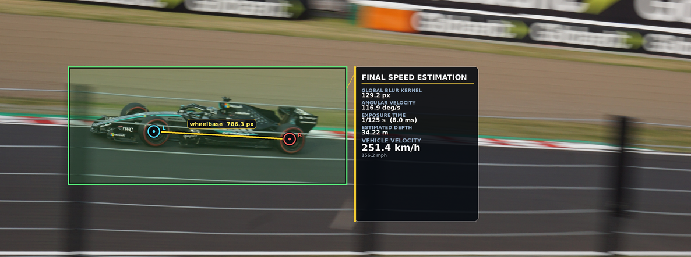

# Panning Shot Analysis — Blur Kernel Estimation & Speed Recovery

Recovers the camera angular velocity and F1 car ground speed from a single
panning photograph paired with a sharp reference image of the same car.

The core idea: motion blur in a panning shot is **signal, not degradation**.
The length and direction of the blur kernel encode the camera trajectory during
the exposure. By comparing the blurry frame to a registered sharp reference,
we can extract that kernel without any deconvolution.

---



## Pipeline Overview

```
pan_1.jpg
  │
  ├─[ Stage 1 ] pipeline/segment_car.py
  │              Grounded SAM2 → car_mask.png / track_mask.png
  │
  ├─[ Stage 2 ] pipeline/register_reference.py  +  sharp_1.jpg
  │              LoFTR/SIFT/ORB + RANSAC → sharp_registered.png
  │
  ├─[ Stage 3 ] pipeline/kernel_estimation.py
  │              gradient-aware patch filtering + pixel-domain blur fit
  │              → kernel_map.npz / kernel_map.png
  │
  ├─[ Stage 4 ] pipeline/trajectory_fitting.py
  │              weighted RANSAC + WLS → trajectory.json
  │
  └─[ Stage 5 ] pipeline/estimate_car_speed.py
                 EXIF focal metadata + 3400 mm wheelbase
                 → car_speed.json / final_result.png
```

By default, full runs write to `outputs/<blurry_stem>__<sharp_stem>/`
(for example, `outputs/pan_1__sharp_1/` for `pan_1.jpg` and `sharp_1.jpg`).
When running stages individually, pass the same `--out_dir` to keep artifacts in
the pair directory.

---

## Stages

### Stage 1 — Scene Segmentation (`pipeline/segment_car.py`)

Isolates the F1 car and the asphalt/track surface so both are excluded from background kernel estimates.

- **Grounding DINO** (text-prompted open-vocabulary detector) produces bounding
  boxes from a natural-language prompt (`"formula 1 racing car . f1 car . race car ."`).
- **SAM 2** refines those boxes into pixel-accurate instance masks.
- A second open-vocabulary prompt segments asphalt/road/track surface into `track_mask.png`; Stage 3 treats this as an exclusion mask so road-plane patches do not bias kernel fitting.

Outputs:
- `outputs/pan_1__sharp_1/car_mask.png` — binary mask (255 = car, 0 = background)
- `outputs/pan_1__sharp_1/track_mask.png` — binary mask (255 = track/asphalt to exclude, 0 = other)
- `outputs/pan_1__sharp_1/car_detection.png` — car overlay visualization
- `outputs/pan_1__sharp_1/track_detection.png` — track/asphalt overlay visualization
- `outputs/pan_1__sharp_1/car_detection.json` — GroundingDINO car boxes used as Stage 5 crop metadata
- `outputs/pan_1__sharp_1/track_detection.json` — GroundingDINO track/asphalt boxes used for exclusion

```bash
python pipeline/segment_car.py --image pan_1.jpg --out_dir outputs/pan_1__sharp_1
```

---

### Stage 2 — Reference Registration (`pipeline/register_reference.py`)

Warps `sharp_1.jpg` into the coordinate frame of `pan_1.jpg` via a projective
homography so that each background pixel in the blurry image has a corresponding
sharp pixel from the reference.

- **LoFTR** is the default matcher for the homography baseline. SIFT and ORB
  remain available with `--matcher sift` or `--matcher orb`.
- Images are resized to `long_side=840 px` before matching, then matches are
  scaled back to full resolution before RANSAC.
- Add `--depth_warp --depth_provider da3` or `--depth_warp --depth_provider vggt`
  to also save a depth-based unprojection/reprojection warp for comparison.
- Car-region matches are suppressed using the Stage 1 mask before homography
  estimation, since the car occupies a different depth plane.
- A validity mask tracks which pixels of the warped image contain real data
  vs. zero-padded fill, so Stage 3 can skip boundary patches.

Outputs:
- `outputs/pan_1__sharp_1/sharp_registered.png` — sharp reference in blurry image frame
- `outputs/pan_1__sharp_1/sharp_registered_valid.png` — coverage mask (white = valid)
- `outputs/pan_1__sharp_1/homography.npy` — 3×3 homography H (maps sharp → blurry)
- `outputs/pan_1__sharp_1/registration_debug.png` — inlier match visualization

```bash
python pipeline/register_reference.py --blurry pan_1.jpg --sharp sharp_1.jpg --out_dir outputs/pan_1__sharp_1
```

---

### Stage 3 — Kernel Estimation (`pipeline/kernel_estimation.py`)

Estimates the blur kernel length `b` (in pixels) for each background patch using
the registered sharp image as a reference. The blur direction `φ` is treated as
a **global** constant (camera motion direction) and estimated once from the full
blurry image before any per-patch fitting.

#### Global blur direction

A weighted Sobel gradient histogram is built from the **entire blurry image**
(car pixels masked out). The dominant gradient direction + 90° gives `φ`. Using
the full image instead of per-patch estimates avoids direction errors caused by
patches where local scene gradients dominate over the blur signature.

```
φ = argmax_θ Σ_pixels |∇I| · [angle(∇I) == θ] + 90°
```

#### Per-patch kernel length

For each eligible background patch (not car, fully covered by the registered
sharp, sufficient structural content in the sharp reference):

**Gradient-aware patch selection**

Before fitting a kernel, each registered sharp patch is scored for structural
content using Sobel gradient energy, gradient-magnitude variance, and Harris
corner response. Low-energy patches are skipped by default; `--grad_var_thres`
and `--harris_thres` can further require high-contrast texture or strong corners.
The saved `confidence` is the texture score (`grad_energy + grad_mag_var`), so
high-texture patches carry more weight downstream.

**Primary estimate — pixel-domain MSE (`b_px_pixel`)**

Before pixel comparison, the sharp patch is aligned to the blurry patch in the
**perpendicular-to-blur direction** using phase cross-correlation (aligning along
the blur axis would confound with `b`). Then `b` is found by minimising
pixel-domain reconstruction error over the full search range with no prior:

```
b_px_pixel = argmin_{b ∈ [1, 0.45·P]}  ||blur_patch − sharp_aligned ⊛ k(b, φ)||²
```

Empirically this yields more accurate kernel estimates than initialising from the
spectral fit, because the spectral ratio is sensitive to registration noise and
JPEG compression artefacts in the frequency domain. `pipeline/trajectory_fitting.py` and
the uniform trajectory baseline both use `b_px_pixel`.

The default pixel-domain comparison now uses `--photometric_mode robust_norm`,
which normalizes each patch by robust median/percentile statistics before
comparing candidate blur lengths. Other modes are available for ablations:
`raw`, `patch_affine`, `global_affine`, `gradient`, and `exif_linear`.

**Auxiliary estimate — spectral sinc² fit (`b_px_spec`)**

Kept for diagnostics and side-by-side comparison in `kernel_patch_grid.png`.
Rotate both patches so `φ` is horizontal, compute the marginal power spectrum
ratio, and fit:

```
P_blur(fx) / P_sharp(fx)  ≈  sinc²(b · fx)
```

The ratio is median-filtered and the fit is done in the log domain with
low-frequency weighting (higher SNR at low f). Stored in `kernel_map.npz` as
`b_px_spec` but not used downstream.

#### Patch quality filters

| Filter | Criterion |
|--------|-----------|
| `skip_car` | patch car fraction > 10% |
| `skip_excluded_region` | patch track/asphalt fraction > 25% |
| `skip_invalid_region` | valid mask coverage < 95% |
| `skip_flat_sharp` | Sobel energy in sharp patch < threshold (kernel underdetermined) |
| `skip_low_texture` | gradient-magnitude variance < threshold |
| `skip_no_corner` | max Harris corner response < threshold |

#### Uniform trajectory baseline

A single global kernel `(b_global, φ)` is also computed as the
confidence-weighted mean of all valid `b_px_pixel` estimates and applied to the
**full registered sharp image**, producing a direct residual comparison against
`pan_1.jpg` without trajectory fitting.

Outputs:
- `outputs/pan_1__sharp_1/kernel_map.npz` — per-patch arrays: `b_px`, `b_px_spec`, `b_px_pixel`, `phi_deg`, `confidence`, `car_frac`, `exclude_frac`, texture metrics, `status`
- `outputs/pan_1__sharp_1/kernel_map.csv` — same as CSV
- `outputs/pan_1__sharp_1/kernel_map.png` — overlay: arrows show blur direction, colour encodes `b_px_pixel`
- `outputs/pan_1__sharp_1/kernel_patch_grid.png` — 8×6 diagnostic grid (4 near-mean + 4 outlier patches)
- `outputs/pan_1__sharp_1/photometric_summary.json` — selected photometric mode, EXIF comparison, gain/offset, and patch-loss summary
- `outputs/pan_1__sharp_1/uniform_traj.json` — global `(Bx, By, b, φ)` from weighted mean
- `outputs/pan_1__sharp_1/uniform_trajectory_residual.png` — blurry | re-blurred | |residual|

```bash
python pipeline/kernel_estimation.py --blurry pan_1.jpg --out_dir outputs/pan_1__sharp_1
```

Key arguments:

| Argument | Default | Description |
|----------|---------|-------------|
| `--patch_size` | 400 | Patch edge length in pixels |
| `--photometric_mode` | `robust_norm` | Intensity-mismatch mitigation: `raw`, `patch_affine`, `global_affine`, `robust_norm`, `gradient`, or `exif_linear` |
| `--exclude_mask` | — | Optional binary mask for regions to exclude from kernel fitting, normally `track_mask.png` |
| `--exclude_overlap_thres` | 0.25 | Max allowed fraction of a patch covered by the exclusion mask |
| `--grad_energy_thres` | 100 | Min Sobel energy in sharp patch |
| `--grad_var_thres` | 0 | Min gradient-magnitude variance; 0 disables |
| `--harris_thres` | 0 | Min max Harris corner response; 0 disables |
| `--global_phi` | — | Hard-override blur direction (skips pre-pass) |
| `--valid_thres` | 0.95 | Min fraction of patch covered by registration |

---

### Stage 4 — Trajectory Fitting (`pipeline/trajectory_fitting.py`)

Fits a global 2D displacement vector **B = (Bx, By)** in pixel space from all
inlier patch estimates. Under constant-velocity panning, each patch's blur
length satisfies:

```
b_i = Bx · cos(φ_i) + By · sin(φ_i)
```

This is solved with weighted RANSAC followed by weighted least squares on the
consensus inlier set. RANSAC samples are biased toward high-confidence texture
patches, and the final WLS fit uses the selected weight field (`confidence` by
default). Use `--disable_ransac` to fall back to sigma-clipped WLS.

Because all φ_i are nearly identical (pure panning), the system is nearly
rank-1. When the weighted spread of φ is < 5°, a 1D scalar fit is used instead
of the full 2D WLS to avoid numerical amplification of noise into the
perpendicular component.

#### Physical conversion

```
focal length          f_px = panning-image focal length in pixels
angular displacement  α = |B| / f_px                 [rad]
angular velocity      ω = α / panning_exposure_time  [rad/s]
```

Stage 4 reads focal length and exposure from the panning image EXIF when those
standard tags are available. The original sharp-reference image can be supplied
with `--sharp_image`; its EXIF is stored in `trajectory.json` only for comparison
so differences between the reference frame and panning frame are visible. If EXIF
is stripped, Stage 4 falls back to the previous Sony a5100 defaults
(`31 mm`, `23.5 mm` sensor width, `1/125 s`) or accepts explicit
`--focal_px`, `--focal_mm --sensor_width_mm`, and `--exposure_s` overrides.

Outputs:
- `outputs/pan_1__sharp_1/trajectory.json` — fitted parameters + physical quantities (ω in deg/s and rad/s)
- `outputs/pan_1__sharp_1/trajectory_residual.png` — blurry | re-blurred sharp | |residual|
- `outputs/pan_1__sharp_1/trajectory_scatter.png` — measured vs predicted `b` per patch + spatial residual map
- `outputs/pan_1__sharp_1/kernel_contribution_map.png` — patch overlay showing RANSAC inliers/outliers and weighted contribution to the final blur length

```bash
python pipeline/trajectory_fitting.py --blurry pan_1.jpg --sharp_image sharp_1.jpg --out_dir outputs/pan_1__sharp_1 --ransac_residual_thres 15
```

Use `--manual_blur_px 140` to annotate an eyeballed blur-length reference on `kernel_contribution_map.png`.
For stripped JPEGs, pass panning-camera values explicitly, for example
`--focal_mm 31 --sensor_width_mm 23.5 --exposure_s 0.008`.

---

### Stage 5 — Car Speed Estimation (`pipeline/estimate_car_speed.py`)

Estimates the car speed from the fitted camera pan rate and the apparent car
wheelbase. The default real wheelbase is `3400 mm`; the image wheelbase is the
distance between detected or manually supplied wheel centers.

```
depth_m = focal_px * wheelbase_m / wheelbase_px
speed_m_s = omega_rad_s * depth_m
```

`focal_px` is read from EXIF focal metadata when available. If the JPEG has been
stripped, the script falls back to the focal calibration saved in
`trajectory.json`, or you can pass `--focal_px` / `--focal_mm --sensor_width_mm`.
Wheel centers are estimated by cropping to the Stage 1 GroundingDINO car bbox,
running a wheel/tire GroundingDINO prompt inside that subset, and refining wheel
boxes with SAM2 masks. The measurement can still be overridden with
`--left_wheel x y --right_wheel x y` or `--wheelbase_px`.

Outputs:
- `outputs/pan_1__sharp_1/car_speed.json` — depth, speed, focal source, wheelbase measurement, assumptions
- `outputs/pan_1__sharp_1/car_speed_wheels.png` — wheel-center measurement overlay
- `outputs/pan_1__sharp_1/final_result.png` — final speed estimation diagram with wheelbase, blur, pan rate, depth, and velocity

```bash
python pipeline/estimate_car_speed.py --image pan_1.jpg --out_dir outputs/pan_1__sharp_1
```

---

## Running the Full Pipeline

```bash
conda activate tttnvs

python pipeline/run_pipeline.py --blurry pan_1.jpg --sharp sharp_1.jpg
```

### Experimental Blind Pipeline

A reference-free path is available when no sharp image is supplied. It keeps the
car segmentation and speed stages, but replaces registration and reference-based
kernel fitting with blind spectral-notch kernel estimation from the blurry
background patches:

```bash
python pipeline/run_blind_pipeline.py --blurry pan_1.jpg
```

Blind outputs default to `outputs/<blurry_stem>__blind/`. The blind estimator is
noisier than the reference-based pipeline because it assumes the latent
background spectrum is locally smooth; use it as a diagnostic or fallback when a
sharp reference is unavailable. Its default `--b_min 120` avoids short-harmonic
notch fits on high-speed panning shots; lower it for gentler blur.

The runner pins child processes to GPU 4 by default and writes all artifacts to
`outputs/<blurry_stem>__<sharp_stem>/` (for the command above, `outputs/pan_1__sharp_1/`). It skips
stages whose expected outputs already exist; add `--force` to rerun from scratch.

Useful variants:

```bash
# Print the commands without running them.
python pipeline/run_pipeline.py --dry-run

# Rerun kernel estimation, trajectory fitting, and speed estimation.
python pipeline/run_pipeline.py --start-at kernel --force

# Rerun only speed estimation after manually specifying wheel centers.
python pipeline/run_pipeline.py --start-at speed --stop-after speed --left_wheel 1650 3350 --right_wheel 2320 3350

# Run a fresh pipeline into a named subdirectory under outputs/.
python pipeline/run_pipeline.py --out_dir outputs/pan_1__sharp_1_rerun --force
```

The stages can still be run individually for debugging. These commands use the
same `outputs/pan_1__sharp_1/` run directory explicitly:

```bash
python pipeline/segment_car.py --image pan_1.jpg --out_dir outputs/pan_1__sharp_1
python pipeline/register_reference.py --blurry pan_1.jpg --sharp sharp_1.jpg --out_dir outputs/pan_1__sharp_1
python pipeline/kernel_estimation.py --blurry pan_1.jpg --out_dir outputs/pan_1__sharp_1
python pipeline/trajectory_fitting.py --blurry pan_1.jpg --sharp_image sharp_1.jpg --out_dir outputs/pan_1__sharp_1
python pipeline/estimate_car_speed.py --image pan_1.jpg --out_dir outputs/pan_1__sharp_1
```

Panning-camera calibration is read from the blurry image EXIF when possible.
If the JPEGs have been stripped, pass `--pan_focal_px` or
`--pan_focal_mm --pan_sensor_width_mm --pan_exposure_s` to `run_pipeline.py`.
`trajectory.json` records both the panning-frame metadata and the sharp-reference
metadata comparison.

---

## Output Summary

Paths are relative to a run directory such as `outputs/pan_1__sharp_1/`.

| File | Stage | Description |
|------|-------|-------------|
| `car_mask.png` | 1 | Binary car segmentation |
| `track_mask.png` | 1 | Binary track/asphalt exclusion segmentation |
| `car_detection.json` | 1 | GroundingDINO car boxes and selected crop bbox |
| `track_detection.json` | 1 | GroundingDINO track/asphalt boxes used for exclusion |
| `sharp_registered.png` | 2 | Sharp reference in blurry frame |
| `sharp_registered_valid.png` | 2 | Registration coverage mask |
| `kernel_map.npz` | 3 | Per-patch kernel estimates |
| `kernel_map.png` | 3 | Kernel map overlay |
| `kernel_patch_grid.png` | 3 | Patch diagnostic grid (spectral vs pixel) |
| `photometric_summary.json` | 3 | Photometric mode and intensity-normalization summary |
| `uniform_traj.json` | 3 | Single-kernel baseline |
| `uniform_trajectory_residual.png` | 3 | Baseline residual image |
| `trajectory.json` | 4 | Fitted B, φ, ω |
| `trajectory_residual.png` | 4 | Full-image re-blur residual |
| `trajectory_scatter.png` | 4 | Measured vs predicted scatter |
| `kernel_contribution_map.png` | 4 | Patch contributions to the final blur length |
| `car_speed.json` | 5 | Estimated car depth and speed |
| `car_speed_wheels.png` | 5 | Wheel-center measurement overlay |
| `final_result.png` | 5 | Final speed estimation diagram with wheelbase and motion metrics |

---

## Dependencies

```
torch           # GPU inference for LoFTR, SAM 2, and optional depth providers
kornia          # LoFTR matcher
transformers    # Grounding DINO + SAM 2 via HuggingFace
opencv-python   # SIFT/ORB, homography, warping
scipy           # Sobel, rotation, optimization
matplotlib
Pillow
```

Tested under the `tttnvs` conda environment.
